# Install SEED VM on VirtualBox

## Account Information of this VM

- User name: `seed`
- Password: `dees`

## Preparation

Before installing the SEED VM, please do the following:

- Install the free [VirtualBox](https://www.virtualbox.org/) software first. The VM has been tested on Version `7.2.4`.

- Download the zip file `SEED-Ubuntu20.04.zip` from the
[Google Drive](https://drive.google.com/file/d/138fqx0F8bThLm9ka8cnuxmrD6irtz_4m/view?usp=sharing) or [DigitalOcean](https://seed.nyc3.cdn.digitaloceanspaces.com/SEED-Ubuntu20.04.zip), unzip it,
and you will get a `.vdi` file. This file contains the pre-built SEED
Ubuntu 20.04 image. This document shows how to build a virtual machine
using this image.

## Step 1: Create a New VM in VirtualBox

We need to use `New` to create a new virtual machine.

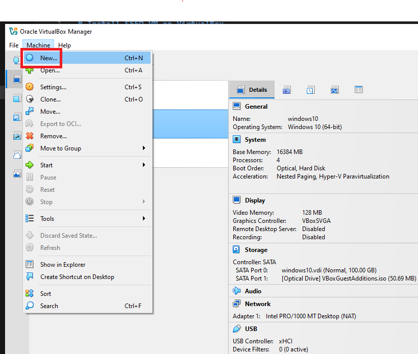

## Step 2: Provide a Name and Select the OS Type and Version

I'm using `cs335-fall226` as the VM Name. Our prebuilt Ubuntu 20.04 VM is 64-bit, so select `Ubuntu (64-bit)`, then click `Finish`.

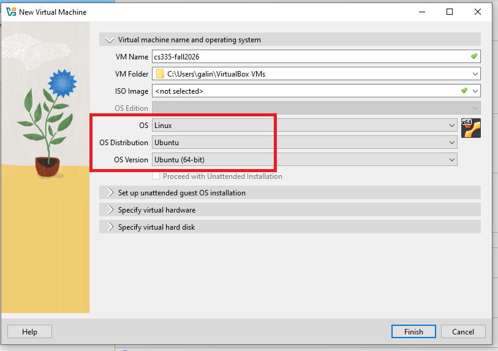

## Step 3: Set the Memory Size

We need to allocate dedicated memory for the VM. While `2 GB` is sufficient, we recommend allocating `8 GB` or more for better performance.

Click the newly created VM, then click `Select`.

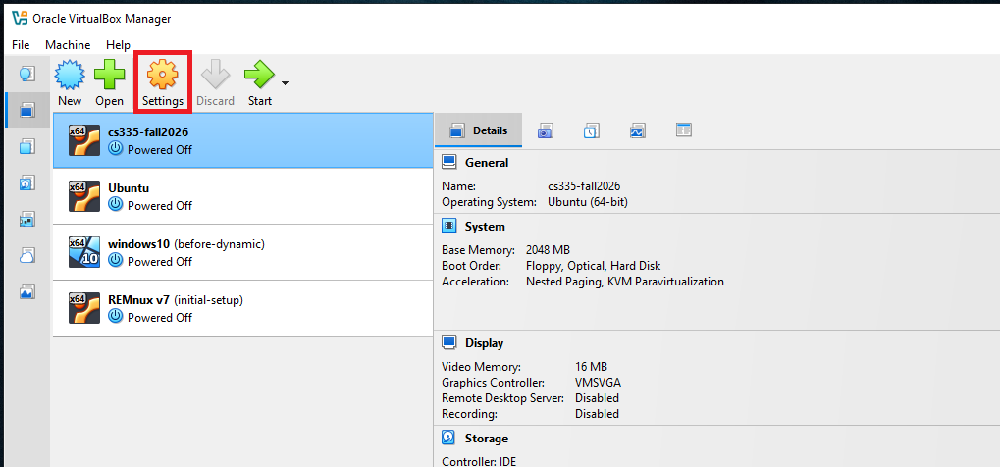

If your computer has more
RAM, you can increase accordingly. The more memory you give to the VM,
the better the performance you will get.

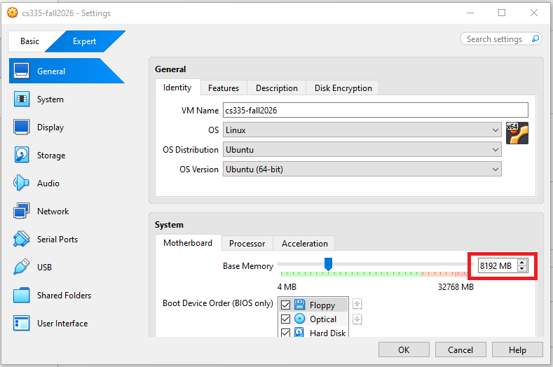

## Step 4: Select the Pre-built VM File Provided by Us

Click the Storage tab, select `cs335-fall226.vdi` and then click the `Remove attachment` icon. 

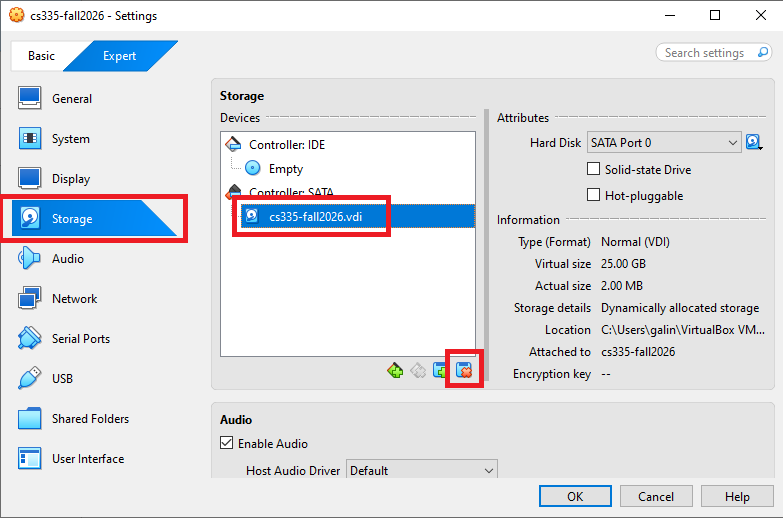

Click the `Add attachment` button, then select `Hard disk`

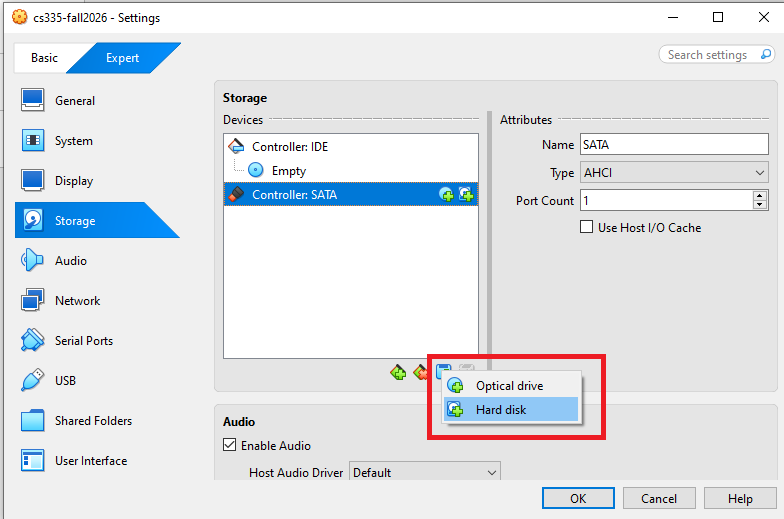

In the pop-up window, click `Add` to browse for and select the `.vdi` file downloaded from the SEED website.

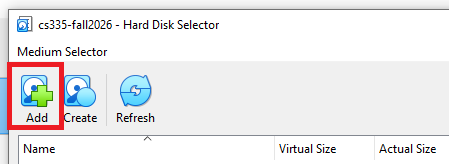

Make sure the correct `.vdi` is selected, then Click `OK`. 

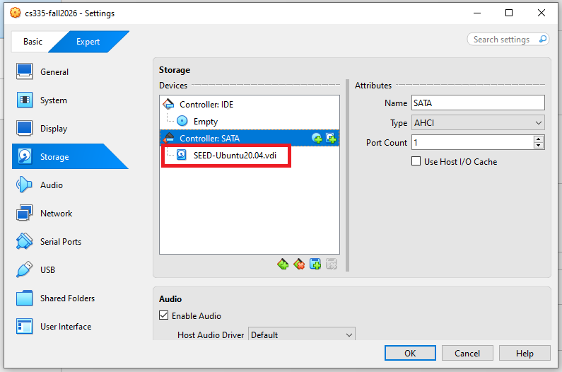

**Note**: If you get an error message saying that the UUID already exists,
this is because the UUID in the selected `vdi` file is the same as the
one used by an existing VM. You can either remove the other VM or
[change the UUID](https://tecadmin.net/change-the-uuid-of-virtual-disk/)
in the `vdi` file.

## Step 5: Configure the VM

After the previous step, your VM will be created, and you will
see it on VirtualBox's VM panel. We need to do some further
configuration. Right-click the VM, click
the `Settings` option, and we will see the Settings window.


### Step 5.a: Enable Copy and Paste

Go to the `General` category, and select the `Features` tab.
Select `Bidirectional` for both items. The first item allows users to copy
and paste between the VM and the host computer
The second item allows users to transfer files between the VM and the host computer using Drag'n Drop (this feature is not always reliable).

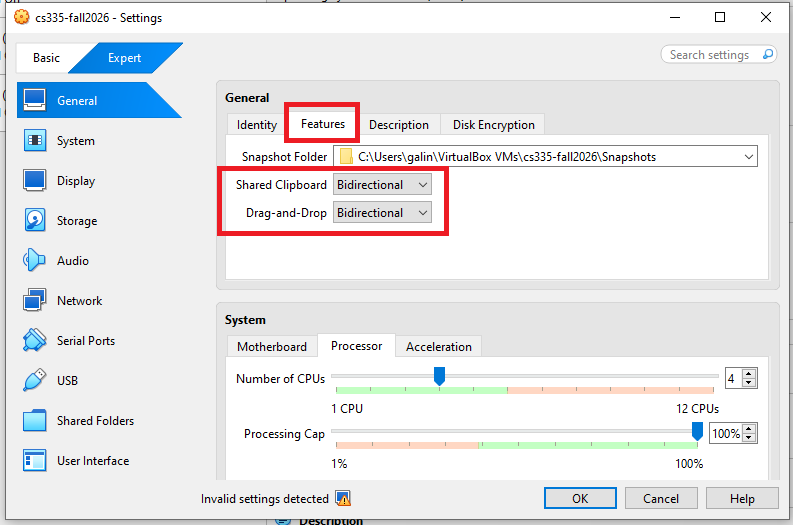

The copy-and-paste feature is very useful. If you can't do copy and paste,
chances are that you forgot to do this step. You can always do it later
by selecting the `Devices` menu item, and you will see the
`Shared Clipboard` submenu.

### Step 5.b: CPUs

Go to the `System` category, and select the `Processor` tab. Assign number of CPUs to this VM if you prefer. Although 1 CPU
may be sufficient, if the performance seems to be an issue, increase the number. I use 4 CPUs. 

Select all the Extended Features that are available. 

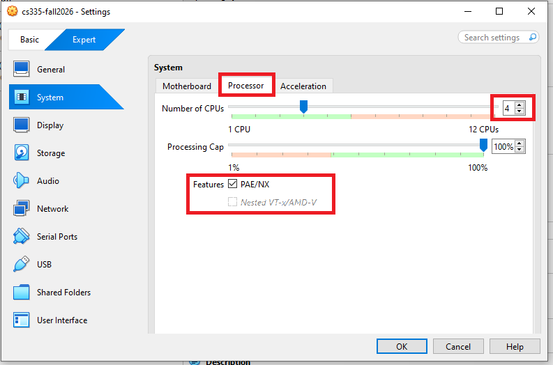 

### Step 5.c: Display

Go to the `Display` category and select the `Screen` tab. If the display does not work properly, try increasing the amount of video memory. In our testing, 64 MB is sufficient; however, allocating at **least 128 MB** is recommended. Low video memory may cause a black screen error in VirtualBox.

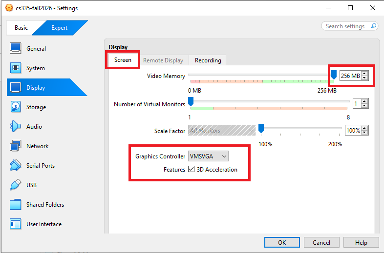

**Note 1**: Make sure to select `VMSVGA`, as choosing other graphic controllers
may lead to the crash of the VM.

**Note 2**: If your computer's screen resolution is too high, the VM may not be able
to match the high resolution. As results, your VM will be very small on your screen.
To make it bigger, adjust the `Scale Factor` in this setting.

### Step 5.d: Network

<!-- Go to the `Network` category, and select the `Adapter 1` tab. We will
choose the `NAT Network` adaptor. Click the `Advanced` drop-down menu to
further configure the network adaptor. If you don't see such an adaptor,
see the note below.-->

Go to the `Network` category, and select the `Adapter 1` tab. We will
choose the `NAT` adaptor.

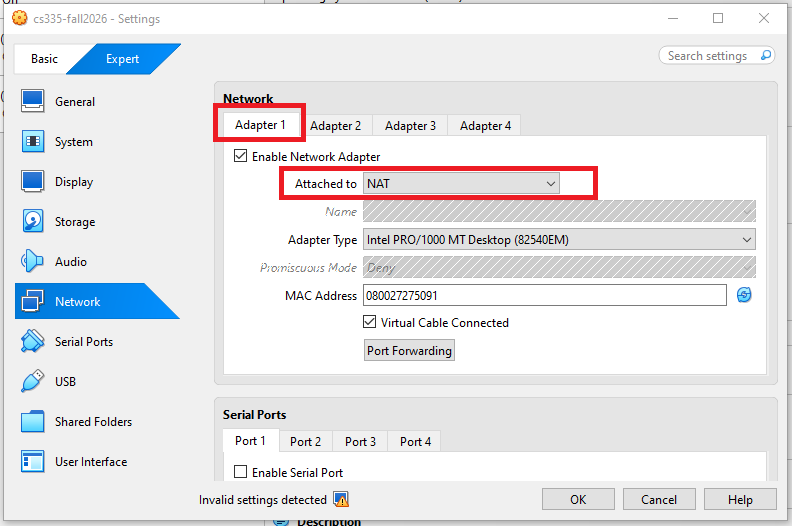

<!-- **Note**: If you don't see the `NAT Network` adaptor, you need to create one.
Go to the `File` menu, click `Preferences...`. You will see a popup window.
Go to the `Network` tab, and you can add a new `Nat Network` adaptor there.-->

## Appendix A: Start the VM

We can now start the VM. 

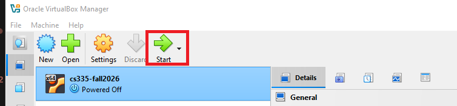

After starting the VM, run the following commands in the terminal:

```bash
sudo apt update
sudo apt upgrade
sudo apt-get autoremove
sudo apt-get clean
```

This will download the latest package information from all configured sources, upgrade all installed packages to their newest versions, remove orphaned packages and unused dependencies, and clear the local package cache by deleting downloaded package files.

## Appendix B: Stop the VM

There are many ways to stop the VM. The best way is to use the `Save State`. This
is different from shutting down the VM. It saves the current VM state, so next time
when you restart the VM, the state will be recovered. Moreover, the speed is also
faster than booting up a VM.

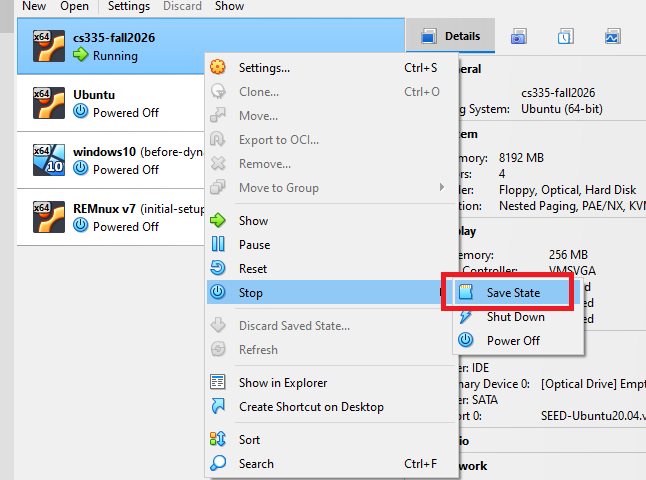

## Appendix C: Taking a snapshot

You can also use the `Take` button to create a snapshot of your VM. This allows you to roll back to a previous state if something goes wrong. Snapshots can be taken while the VM is either stopped or running, though it takes longer to create a snapshot when the VM is running.

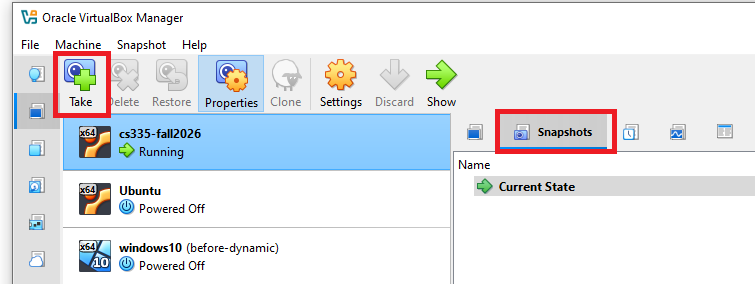

## Appendix D: Creating a Shared Folder

Sometimes, we need to copy files between the host machine and the VM.
If you are using the VM from the cloud, you can see our cloud VM manual
for instructions. Or, you can just use a cloud storage service, such as
Dropbox and Google Drive to share files between your VM and host machine.

If you run the VM on your local computer, you can create a shared folder
between your computer and the VM. We recommend you turn off the VM before you do
Step A. Change the setting while the VM is running may crash the VM.

**Step A.** First you need to create a folder on your local computer (or using
an existing folder). We will let the VirtualBox know that this folder
should be shared with the VM. Go to the following menus:

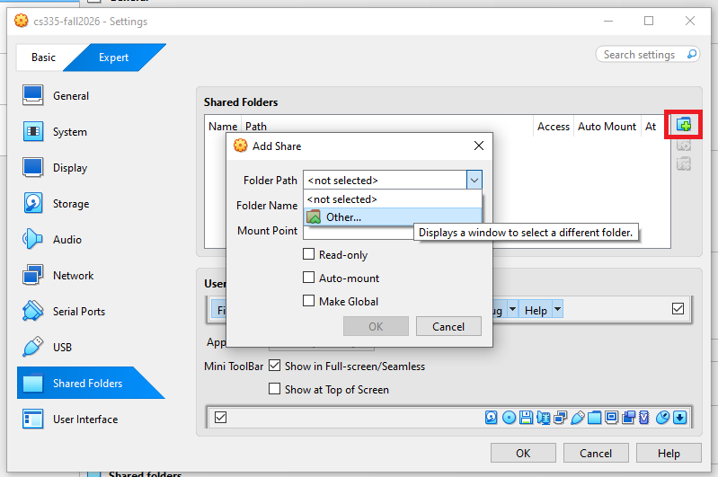

Once you see a `Add Share` popup window, select the folder that
you want to share, click OK, and you will see that the folder is now
made available for sharing.

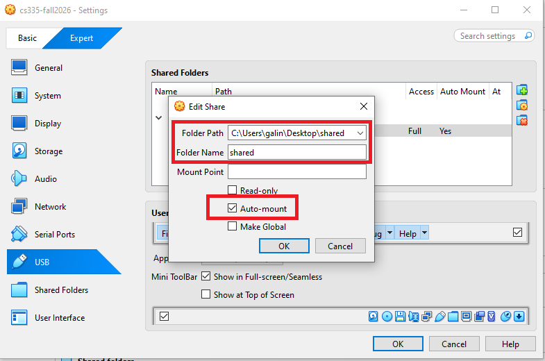

**Step B.** Inside the VM, we need to mount the shared folder somewhere.
Let's mount it to the home directory as a folder `Share`.
We will create a folder called `Share` in the home directory, and then
mount the shared folder `VM_Shared` to this `Share` folder using
the following command. After that, you can access the shared folder
from `~/Share`.

```
$ mkdir -p ~/Share
$ sudo mount -t vboxsf VM_Shared ~/Share
```

On some latest version VirtualBox, the folder `VM_Shared` doesn't mount on
automatically after the VM is restarted 
even if we have selected the auto-mount option.
To solve this issue, we can create an
auto-mount script inside the `/etc/profile.d/` folder.

```
sudo vim /etc/profile.d/seedshare.sh
```

Inside the script file, add the mount command that we want to run when the system
is initialized.
```
sudo mount -t vboxsf VM_Shared ~/Share
```

After the VM is started, during the login phase, all scripts under
`/etc/profile.d` folder will be executed. This way, system automatically will
mount the shared folder `VM_Shared` to the `Share` folder.


**Important Note.** Please only use the shared folder to copy files
between the VM and the host machine, and **never use it
as your working folder**. Working from the shared folder has
caused many problems, especially on the permissions of the files
created inside the shared folder. For example, if we unzip
the `Labsetup.zip` file inside the shared folder, the permissions
of the unzipped files will be different from those on
the original files. Some labs and containers are very
sensitive to those permissions.