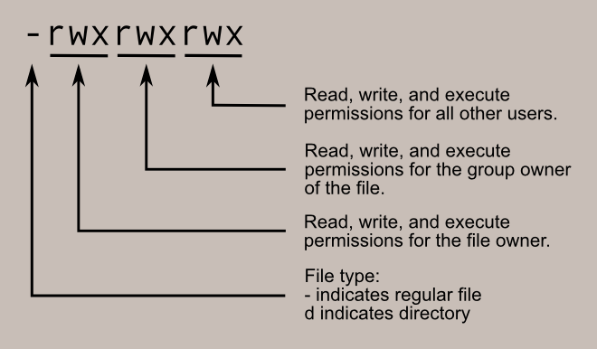

This page contains links to notes and code snippets.

- [Juice Shop Hints](#juice-shop-hints)
- [Juice Shop Intro](#juice-shop-intro)
- [Password Cracking](#password-cracking)
- [Clickjack](#clickjack)
- [SQL](#sql)
- [XSS](#xss)
- [CSRF](#csrf)
- [DNS](#dns)
- [TCP](#tcp)
- [UDP](#udp)
- [IP](#ip)
- [ARP](#arp)
- [Networking](#networking)
- [Buffer Overflow](#buffer-overflow)
- [Shellshock](#shellshock)
- [Reverse Shell](#reverse-shell)
- [Upgrade VM](#upgrade-vm)
- [Setup Environment](#setup-environment)
- [File Commands and Directory Navigation](#file-commands-and-directory-navigation)
- [Permissions](#permissions)
- [Networking](#networking-1)
- [Process commands](#process-commands)
- [Clone a website](#clone-a-website)

#### Juice Shop Hints 
- General Guidance
  - Explore the application thoroughly; unusual behavior is often intentional
  - Review page source for hardcoded secrets, hidden links, or commented-out code
  - Check `robots.txt` for hidden paths or subdomains
  - Inspect `.js` files for hardcoded values, hidden routes, or API clues
  - Use browser developer tools to inspect requests, responses, and storage
  - Start with simple input before trying complex payloads
- SQL Injection
  - Try characters that might affect a query (e.g., quotes)
  - Observe how parameters appear in URLs or request bodies
  - Use a [SQLi cheat sheet](https://portswigger.net/web-security/sql-injection/cheat-sheet) for common patterns and payload ideas
- NoSQL Injection
  - Consider how JSON-based queries work
  - Modify parameters directly in the network tab
  - Test unexpected data types or structures
- Reflected / Stored / DOM XSS
  - Look for inputs that reappear in the page or are stored and shown later
  - Test simple HTML tags to see what gets rendered
  - Check how different pages sanitize or escape input
  - Refer to an [XSS cheat sheet](https://portswigger.net/web-security/cross-site-scripting/cheat-sheet) for common payload structures
- Weak Passwords
  - Think about predictable or default passwords
  - Look for clues in user-visible content
- Password Reset Issues
  - Examine how the reset process verifies identity
  - Consider what information might be publicly accessible
- Login Bypasses
  - Observe how the login form handles unexpected input
  - Try interacting with the API directly
- Horizontal Access Control
  - Compare what different users can access
  - Modify IDs in URLs or requests to test boundaries
- Vertical Access Control
  - Look for admin-only features hidden in the UI
  - Attempt to access admin endpoints directly
- Sensitive Data Exposure
  - Explore publicly accessible folders and files
  - Look for logs, backups, or configuration files
  - Try opening referenced files directly
- Input Validation
  - Determine whether validation happens only on the front end
  - Try disabling or modifying HTML elements (e.g., using dev tools)
  - Check whether URL and API parameters are sanitized server-side
- CSRF
  - Identify actions that change data without re-authentication
  - Check whether these actions can be triggered via simple links
  - Inspect request headers for CSRF tokens or missing protections
- Network Traffic Analysis
  - Inspect all requests in the network tab
  - Look for identifiers, hardcoded credentials, or unusual parameters
  - Check for custom headers or missing security headers
  - Compare request/response patterns when editing or replying to content
  - Trigger or observe server exceptions to reveal additional information
- File Handling and Path Issues
  - To test file download restrictions, try alternate extensions or encodings
  - A NULL byte followed by a permitted extension may bypass filters in some systems
  - Example pattern: `http://localhost:9090/api/coupons.md.bak%2500.md`
    - The encoding `%2500` is a double-encoded sequence where `%25` represents the percent sign `%` and `00` represents the null character `\u0000` 
      - First Decoding: `%25` decodes to the literal character `%`, resulting in `%00`
      - Second Decoding: `%00` decodes to the ASCII NUL (null) character, which is a non-printable control character (decimal `0` or hex `00`)

<a href="#">To top</a>

#### Juice Shop Intro
- [OWASP Juice Shop](https://owasp.org/www-project-juice-shop/)
  - Demo at [https://demo.owasp-juice.shop/#/](https://demo.owasp-juice.shop/#/)
  - [slides](https://juice-shop.github.io/juice-shop/#/)
- ```docker pull bkimminich/juice-shop```
- ```docker run --rm -p 3000:3000 bkimminich/juice-shop```
  - Navigate to http://localhost:3000 

<a href="#">To top</a>

#### Password Cracking
- John The Ripper
  - ```git clone https://github.com/magnumripper/JohnTheRipper.git```
  - ```cd ./JohnTheRipper/src```
  - ```sudo apt-get install libssl-dev```
  - ```./configure```
  - ```make -s clean && make -sj4```
  - ```pip install --user dpkt```
- Single Crack Example:
  - ```echo -n 'pAsSwOrD' | sha256sum```
  - ```echo -n 'password:e37017560675e0e20ef952202f15099012e8840a089649d6680ed2d7eb34fcdf' > password.txt```
  - ```sudo ./john --format=raw-sha256 --single password.txt```
- Wordlists
  - [rockyou.txt](pass\rockyou.txt.tar.gz), extract with ```tar -xvf rockyou.txt.tar.gz```
  - [https://www.openwall.com/wordlists/](https://www.openwall.com/wordlists/)
  - More under [resources](..\resources\index.html) ... 
- Crack me
  - [joke.docx](pass\joke.docx)
  - [joke.pdf](pass\joke.pdf)
  - [joke.zip](pass\joke.zip)
    - ```sudo apt install p7zip-full``` 
    - ```7z x joke.zip```

<a href="#">To top</a>

#### Clickjack 
- iframe Demo: <a href=".\clickjack\index.txt" target="_blank">index.html</a> 
- Labsetup: <a href=".\clickjack\Labsetup.zip">Labsetup.zip</a>

<a href="#">To top</a>

#### SQL
- Setup files: [Labsetup.zip](./sqli/Labsetup.zip)
- Create Table: <a href=".\sqli\create-table.txt" target="_blank">create-table.sql</a>
- Insert Into: <a href=".\sqli\insert-into.txt" target="_blank">insert-into.sql</a>
  
<a href="#">To top</a>

#### XSS
- Setup files: [Labsetup.zip](./xss/Labsetup.zip)
- Example of add a friend script: <a href="./xss/add-a-friend.txt" target="_blank">add-a-friend.js</a>
- Example of update profile script: <a href="./xss/update-profile.txt" target="_blank">update-profile.js</a>
- Self Propagation test: <a href="./xss/self-propagation.html" target="_blank">self-propagation.html</a>

<a href="#">To top</a>

#### CSRF
  - [CSRF Prevention Cheat Sheet](https://cheatsheetseries.owasp.org/cheatsheets/Cross-Site_Request_Forgery_Prevention_Cheat_Sheet.html)
  - Setup files: [Labsetup.zip](.\csrf\Labsetup.zip)

| User    | User Name | Password    |
| ------- | --------- | ----------- |
| Admin   | admin     | seedelgg    |
| Alice   | alice     | seedalice   |
| Boby    | boby      | seedboby    |
| Charlie | charlie   | seedcharlie |
| Samy    | samy      | seedsamy    |

<a href="#">To top</a>

#### DNS
- [https://www.internic.net/domain/root.zone](https://www.internic.net/domain/root.zone)
- Send DNS query: <a href=".\dns\send_dns_query.txt" target="_blank">send_dns_query.py</a>
- DNS server: <a href=".\dns\dns-server.txt" target="_blank">dns-server.py</a>
- RFC
  - Domain Name System (DNS) IANA Considerations: [6895](https://tools.ietf.org/html/rfc6895)
  - DOMAIN NAMES - IMPLEMENTATION AND SPECIFICATION: [1035](https://tools.ietf.org/html/rfc1035)
  - Resource Records for the DNS Security Extensions: [4034](https://www.rfc-editor.org/rfc/rfc4034)
- DNS Cache 
  - Dump: ```rndc dumpdb -cache```
  - View: ```cat /var/cache/bind/dump.db```
  - Flush: ```rndc flush```
- Potential Traffic Issues 
  - Delay by 100ms: ```tc qdisc add dev eth0 root netem delay 100ms```
  - Delete the `tc` entry: ```tc qdisc del dev eth0 root netem```
  - Show all `tc` entries: ```tc qdisc show dev eth0```
- Setup files: [Labsetup.zip](.\dns\Labsetup.zip)

<a href="#">To top</a>

#### TCP
- Docker Compose: <a href=".\tcp\docker-compose.yml" target="_blank">docker-compose.yml</a>
- Client: <a href=".\tcp\client.txt" target="_blank">client.py</a>
- Server: <a href=".\tcp\server.txt" target="_blank">server.py</a>
- Multi Server: <a href=".\tcp\server2.txt" target="_blank">server2.py</a>
- SynFlooding Attack
  - Python: <a href=".\tcp\synflood.txt" target="_blank">synflood.py</a>
  - C: <a href=".\tcp\synflood.c" target="_blank">synflood.c</a>
  - ```sysctl -w net.ipv4.tcp_syncookies=0```
  - ```sysctl -w net.ipv4.tcp_max_syn_backlog=80```
  - ```ip tcp_metrics flush```
- Reset: <a href=".\tcp\reset.txt" target="_blank">reset.py</a>
- Auto Reset: <a href=".\tcp\auto_reset.txt" target="_blank">auto_reset.py</a>
- Hijack Session: <a href=".\tcp\hijack.txt" target="_blank">hijack.py</a>
  
<a href="#">To top</a>

#### UDP 
- Client: <a href=".\udp\udp_client.txt" target="_blank">udp_client.py</a>
- Time Server: <a href=".\udp\udp_server.txt" target="_blank">udp_server.py</a>
- Docker Compose: <a href=".\udp\docker-compose.yml" target="_blank">docker-compose.yml</a>
- Attack: <a href=".\udp\udp_attack.txt" target="_blank">udp_attack.py</a>
- UDP Flood: <a href=".\udp\flood.txt" target="_blank">flood.py</a>
- DNS Query: <a href=".\udp\dns.txt" target="_blank">dns.py</a>

<a href="#">To top</a>

#### IP 
- Ping: <a href=".\ip\ping.txt" target="_blank">ping.py</a>
- Traceroute: <a href=".\ip\traceroute.txt" target="_blank">traceroute.py</a>
- Docker Compose: <a href=".\ip\docker-compose.yml" target="_blank">docker-compose.yml</a>
- Fragment: <a href=".\ip\fragment.txt" target="_blank">fragment.py</a>
- ICMP: <a href=".\ip\icmp.txt" target="_blank">icmp.py</a>
- ICMP Redirect: <a href=".\ip\icmp_redirect.txt" target="_blank">icmp_redirect.py</a>
  - ```sysctl net.ipv4.conf.all.accept_redirects=1```
- mitm: <a href=".\ip\mitm.txt" target="_blank">mitm.py</a>

<a href="#">To top</a>

#### ARP
- Docker Compose: <a href=".\arp\docker-compose.yml" target="_blank">docker-compose.yml</a>
- arp_request: <a href=".\arp\arp_request.txt" target="_blank">arp_request.py</a>
- arp poisoning: <a href=".\arp\arp.txt" target="_blank">arp.py</a>
- arp mitm: <a href=".\arp\mitm.txt" target="_blank">mitm.py</a>
  - ```sysctl -w net.ipv4.ip_forward=0```
  
<a href="#">To top</a>

#### Networking 
- udp_client: <a href=".\network\udp_client.txt" target="_blank">udp_client.py</a>
- udp_server: <a href=".\network\udp_server.txt" target="_blank">udp_server.py</a>
- Lab Setup: <a href=".\network\docker-compose.yml" target="_blank">docker-compose.yml</a>
- Scapy: 
  - sniff: <a href=".\network\sniff.txt" target="_blank">sniff.py</a>
  - icmp_spoof: <a href=".\network\icmp_spoof.txt" target="_blank">icmp_spoof.py</a>
  - udp_spoof: <a href=".\network\udp_spoof.txt" target="_blank">udp_spoof.py</a>
  - sniff_spoof: <a href=".\network\sniff_spoof.txt" target="_blank">sniff_spoof.py</a>
  
<a href="#">To top</a>

#### Buffer Overflow 
- Memory Layout: <a href=".\buffer\layout.c" target="_blank">layout.c</a>
  - Use ```-m32```
- Buffer Overflow Example: <a href=".\buffer\buffer.c" target="_blank">buffer.c</a>
  - Use ```-m32 -fno-stack-protector```
- ASCII vs binary: <a href=".\buffer\print_zero.c" target="_blank">print_zero.c</a>
- ASLR: <a href=".\buffer\aslr.c" target="_blank">aslr.c</a>
- Launching shell: <a href=".\buffer\launch_shell.c" target="_blank">launch_shell.c</a>
- Setup files: [Labsetup.zip](.\buffer\Labsetup.zip)
  - Turn off address randomization: ```sudo /sbin/sysctl -w kernel.randomize_va_space=0```
  - Update Symbolic Link: ```sudo ln -sf /bin/zsh /bin/sh```
- Old shellcode: <a href=".\buffer\shellcode.c" target="_blank">shellcode.c</a>
  - Compile with: ```-m32 -z execstack```
- Print *esp*: <a href=".\buffer\sp.c" target="_blank">sp.c</a>

<a href="#">To top</a>

#### Shellshock
- Set-UID Example: <a href=".\shellshock\vul.c" target="_blank">vul.c</a>
- Setup files: [Labsetup.zip](shellshock\Labsetup.zip)
  - ```curl -o Labsetup.zip  https://ycpcs.github.io/cs335-spring2026/notes/shellshock/Labsetup.zip```
  - ```unzip Labsetup.zip```

<a href="#">To top</a>

#### Reverse Shell
- Setup files: [Labsetup.zip](reverse-shell\Labsetup.zip)
- File Descriptors Intro: <a href=".\reverse-shell\fd.c" target="_blank">fd.c</a> 
- Redirection: <a href=".\reverse-shell\redirect.c" target="_blank">redirect.c</a>
- Duplicate a file descriptor: <a href=".\reverse-shell\dup.c" target="_blank">dup.c</a> and <a href=".\reverse-shell\dup2.c" target="_blank">dup2.c</a>
- Redirecting IO to TCP Connections: <a href=".\reverse-shell\tcp_in.c" target="_blank">tcp_in.c</a> and <a href=".\reverse-shell\tcp_out.c" target="_blank">tcp_out.c</a>
  
<a href="#">To top</a>

#### Upgrade VM 
- ```sudo apt update``` - downloads package information from all configured sources.
- ```sudo apt upgrade``` - will upgrade all installed packages to their latest versions.
- ```sudo apt-get autoremove``` - deletes orphaned packages, or dependencies that remain installed after you have installed an application and then deleted it.
- ```sudo apt-get clean``` - removes all packages from the cache.

<a href="#">To top</a>

#### Setup Environment
- Sublime: ```sudo snap install sublime-text --classic```  
- Visual Studio Code: ```sudo snap install --classic code```
- clion: ```sudo snap install clion --classic```
   
<a href="#">To top</a>

#### File Commands and Directory Navigation

- ```cd``` go to _$HOME_ directory.
- ```cd ...``` go one level up the directory tree.
- ```cd /etc``` to change to the _/etc_ directory.  
- ```ls``` list all files.
  - Use ```-R``` to list all-subdirectories as well
  - ```-a``` will list hidden files as well
  - Use the ```-al``` argument to view details
- ```pwd``` lists the present working directory.
- ```mkdir directory``` created a _directory_.
- ```rm -r directory``` removes the _directory_ and its contents recursively. Use the ```f``` argument to forcefully remove, re: ```rm -rf directory```.
- ```touch file``` will create an empty _file_.
- ```rm file``` removes a _flle_.
- ```cp file file2``` will copy _file_ to _file2_.
- ```mv file file2``` renames or moves _file_ to _file2_.
- ```cat filename``` will display the contests of _filename_.
- ```cat > filename```  creates a new file with _filename_.
  
<a href="#">To top</a>

#### Permissions



- Legend
  - User or Owner ```U```
  - Group ```G```
  - World (Other Users) ```W```
- Permission Classes
  - Read ```r```
  - Write ```w```
  - Execute ```x```
- File Type
  - ```-``` regular file
  - ```d``` directory
- Examples
  - file _desktop.ini_: ```-rwxrwxrwx 1 seed seed 282 Dec 27 10:10 desktop.ini```
  - directory _host_: ```drwxrwxrwx 1 seed seed 4096 Jan 20 13:22 host```

  | Number | Permission Type       | Symbol |
  | ------ | --------------------- | ------ |
  | 0      | No Permission         | ---    |
  | 1      | Execute               | --x    |
  | 2      | Write                 | -w-    |
  | 3      | Execute + Write       | -wx    |
  | 4      | Read                  | r--    |
  | 5      | Read + Execute        | r-x    |
  | 6      | Read +Write           | rw-    |
  | 7      | Read + Write +Execute | rwx    |
- Permission Examples  
  - ```chmod 777 filename```: _rwx rwx rwx_
  - ```chmod 775 filename```: _rwx rwx r-x_
  - ```chmod 755 filename```: _rwx r-x r-x_
  - ```chmod 664 filename```: _rw- rw- r--_
  - ```chmod 644 filename```: _rw- r-- r--_

<a href="#">To top</a>

#### Networking

- ```ifconfig -a``` displays all network interfaces and IP address.
- ```hostname -I``` displays the IP addresses of the host (all local IP addresses).
- ```host domain``` displays IP address for _domain_.
- ```ping host``` sends ICMP echo request to _host_.
- ```whois domain``` displays whois records for _domain_.
- ```dig domain``` displays DNS information for _domain_.
- ```dig -x IP``` does reverse lookup of _IP_ address.
- ```nslookup``` query Internet name servers interactively.
- To display the IP/kernel routing table:
  - ```netstat -rn```
  - ```ip route```
  - ```route -n```

<a href="#">To top</a>

#### Process commands

- ```bg``` sends a process to the background.
- ```fg```	runs a stopped process in the foreground.
- ```top``` shows	details on all active processes.
- ```ps```	gives the status of processes running for a user.
- ```pidof```	gives the process id (PID) of a process.
- ```ps PID```	gets the status of a particular process.
- ```kill PID```	kills a process with _PID_ .
- ```nice```	starts a process with a given priority.

<a href="#">To top</a>

#### Clone a website 
```wget --mirror --convert-links --adjust-extension --page-requisites --no-check-certificate --no-parent https://site-to-copy.com```
  - ```--mirror``` make the download recursive.
  - ```--no-parent``` do not crawl the parent/top directory.
  - ```--convert-links``` makes all the links work properly with the offline copy.
  - ```--page-requisites``` download JS/CSS files.
  - ```--adjust-extension``` add the appropriate extensions (e.g. html, css, js) to files.
  - ```--no-check-certificate``` ignores SSL certificate errors
<a href="#">To top</a>
